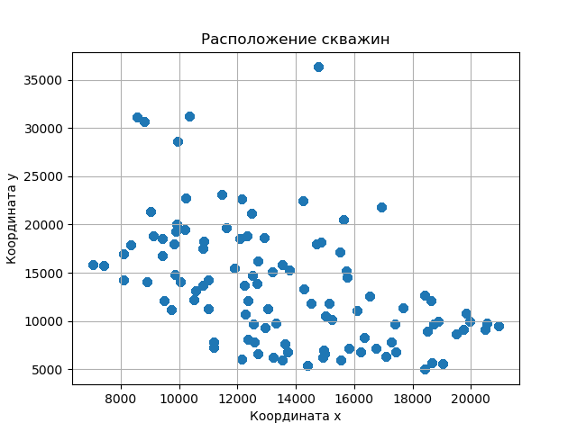
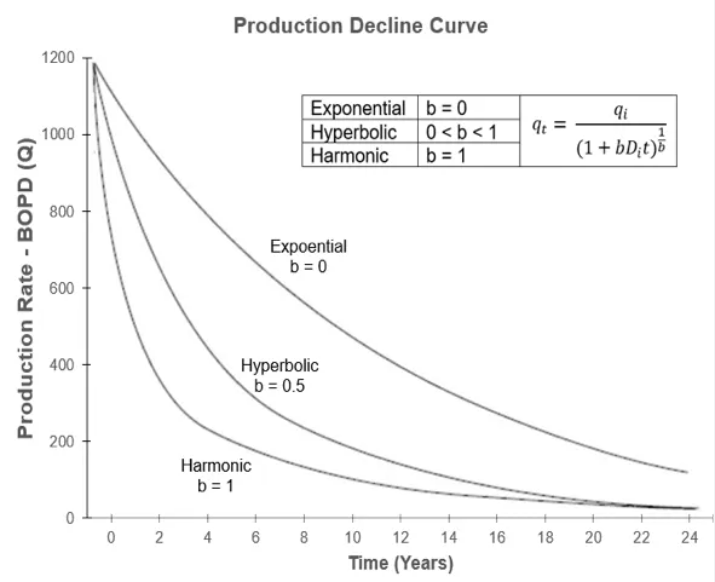

### Задача
Требуется построить модель для прогнозирования дебита нефти на 90 дней вперед, опираясь на предшествующие значения прогнозируемого показателя и (опционально) других параметров работы скважины.

Целевая переменная: `Дебит нефти`

### Структура репозитория
Репозиторий содержит файлы с историей для обучения, код для обучения модели и пример сгенерированных прогнозов. 

* **baseline** - модуль с baseline-решением на основе DCA (Decline Curve Analysis), содержит скрипт для обработки исходных данных и получения прогноза, пример csv файла с прогнозом
* **data** - директория содержит файл "train.csv" с тренировочной выборкой
* **utils.py** - скрипт содержит функцию для вычисления метрики качества - RMSE - для файла с прогнозом
* **docs** - директория содержит вспомогательные материалы и иллюстрации

### Данные для обучения 
Данные для обучения модели расположены в папке "data":
- train.csv - данные для обучения

Характеристики тренировочной выборки:
- Размер таблицы: 67 136 строк на 20 столбцов
- Количество уникальных скважин: 106

Таблица содержит столбцы `datetime`, `Номер скважины`, `Дебит нефти`, 
`Давление забойное`, `x`, `y`, `Объем жидкости`, `Объем нефти`, `Активная мощность (ТМ)`,
 `Время работы (ТМ)`, `Газовый фактор рабочий (ТМ)`, `Давление буферное`, `Давление забойное от Hд`, 
`Давление забойное от Pпр`, `Давление линейное (ТМ)`, `Давление на входе ЭЦН (ТМ)`, `Дебит газа (ТМ)`, 
`Дебит газа попутного`, `Дебит жидкости (ТМ)`, `Коэффициент мощности (ТМ)`. 

Для каждой скважины в train-файле представлены временные ряды длиной не менее 620 элементов. Некоторые скважины содержат большее количество элементов. Дискретность временных рядов - суточная. 

Столбец с целевой переменной не содержит пропусков в данных, однако некоторые интервалы могли быть линейно интерполированы, что видно при построении графиков: интерполированные сегменты временных рядов выглядят как нехарактерно ровная линия на графике.

Столбцы с другими параметрами скважин могут содержать пропуски. При построении модели вы можете использовать все имеющиеся данные, или только часть параметров, или только предшествующие значения целевой переменной – на ваше усмотрение.

Для кластеризации скважин можно использовать координаты их расположения. Пространственное расположение скважин по координатам `x` и `y`:

 

### Метрика для оценки ошибки модели 
[Root Mean Square Error (RMSE)](https://scikit-learn.org/stable/modules/generated/sklearn.metrics.mean_squared_error.html)

Ошибка прогноза будет оцениваться на отложенной выборке, равной одному горизонту прогнозирования. 
Финальная метрика получается усреднением по всем скважинам.

Функцию, используемую для расчета метрики качества, можно найти в файле "utils.py".

### Формат загрузки данных
Ваша модель должна сформировать прогнозы для всех 106 скважин. Пример формируемого файла - "baseline_forecast.csv".
csv файл должен содержать столбцы `datetime`, `forecast`, `Номер скважины`. Предсказания модели должны быть сформированы для 
периода c `1992-04-11` по `1992-07-09` - всего 90 дней.

Пример генерируемой таблицы: 

| datetime   | forecast | Номер скважины |
| :--------: | :------: | :------------: |
| 1992-04-11 | 12\.45   | 0              |
| 1992-04-12 | 11\.06   | 0              |

### Дополнительная информация 

Базовое решение основано на оптимизации параметров, описывающих кривую падения дебита нефти. В этом решении для построения прогноза используются только предшествующие значения целевой переменной.

Подробнее о DCA (Decline Curve Analysis): https://petrowiki.spe.org/Production_forecasting_decline_curve_analysis.

Для решения задачи возможно использование любых моделей и подходов к прогнозированию временных рядов, в том числе алгоритмов AutoML, классических моделей МО, нейронных сетей. Участники могут использовать различные методы заполнения пропусков в данных либо не учитывать параметры, содержащие пропуски. Допускается построение моделей на основе любых наборов параметров, доступных в файле "train.csv".

Доступные в train-выборке данные не позволяют напрямую определить этап жизненного цикла скважины, однако на основе координат расположения скважин и укрупненных показателей их работы можно объединить схожие скважины в кластеры.

Размер скользящего окна для обучения модели и получения прогнозов может быть выбран участниками самостоятельно и включать от нескольких дней, непосредственно предшествующих прогнозному периоду, до 620 дней (гарантированная протяженность временных рядов, доступная по всем скважинам в выборке).

На практике характерные паттерны изменений ключевых показателей при дефектах скважин проявляются на горизонте в 15-20 дней, для оценки общего тренда дебита нефти необходимо использовать более длительные интервалы доступных данных.

Обратите внимание, что прогноз следует формировать в будущее. На прогнозируемые временные метки не будет доступно никакой дополнительной информации, кроме той, что уже выдана участникам в файле "train.csv".
